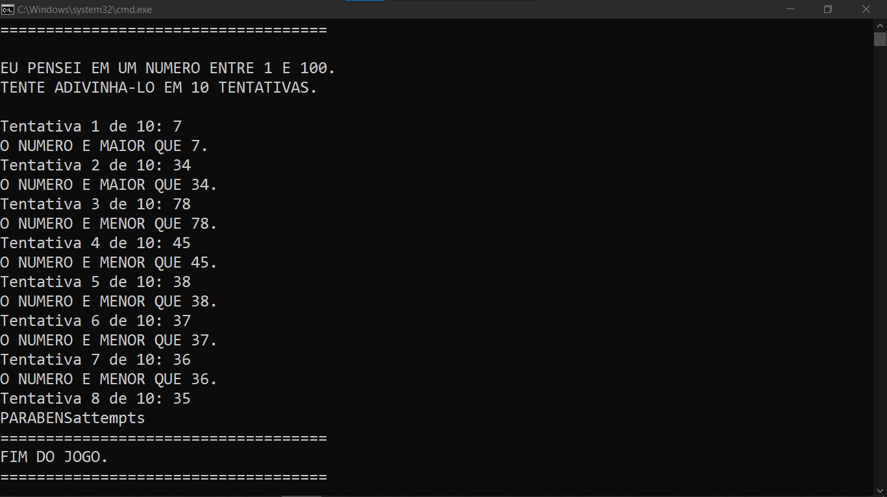

# ADVINHACAO EM BAT  
👨‍🏫O OBJETIVO DO JOGO É ADIVINHAR UM NÚMERO SECRETO QUE O COMPUTADOR ESCOLHEU ALEATORIAMENTE ENTRE 1 E 100.

  

## DESCRIÇÃO:
`Adivinhe o Número` é um jogo simples e divertido de adivinhação. O objetivo do jogo é adivinhar um número secreto que o computador escolheu aleatoriamente entre 1 e 100. Você tem um número limitado de tentativas para adivinhar o número correto.

## EXECUTANDO O PROJETO:
1. **Iniciar o Jogo:**
   - Clique no `CODIGO.bat` para executar.
   - A tela de boas-vindas será exibida, explicando o objetivo do jogo.

2. **Primeiro Palpite:**
   - O jogo solicitará que você insira seu primeiro palpite.
   - Digite um número entre 1 e 100 e pressione Enter.

3. **Receber Feedback:**
   - O jogo dirá se o número secreto é maior ou menor que o seu palpite.
   - Se você adivinhar o número correto, receberá uma mensagem de parabéns.

4. **Tentativas Adicionais:**
   - Continue fazendo palpites até adivinhar o número correto ou até esgotar o número máximo de tentativas (10).
   - O jogo fornecerá feedback após cada palpite.

5. **Fim do Jogo:**
   - Se você adivinhar o número dentro do limite de tentativas, receberá uma mensagem de parabéns.
   - Se você não adivinhar o número dentro do limite de tentativas, o jogo revelará o número secreto.

6. **Jogar Novamente:**
   - Após o fim do jogo, você será perguntado se deseja jogar novamente.
   - Digite "S" para jogar novamente ou "N" para sair do jogo.

## NÃO SABE?
- Entendemos que para manipular arquivos em muitas linguagens e tecnologias, é necessário possuir conhecimento nessas áreas. Para auxiliar nesse aprendizado, oferecemos cursos gratuitos disponíveis:
* [CURSO DE BATCH SCRIPT](https://github.com/VILHALVA/CURSO-DE-BATCH-SCRIPT)
* [CONFIRA MAIS CURSOS](https://github.com/VILHALVA?tab=repositories&q=+topic:CURSO)

## CREDITOS:
- [PROJETO CRIADO PELO VILHALVA](https://github.com/VILHALVA)

